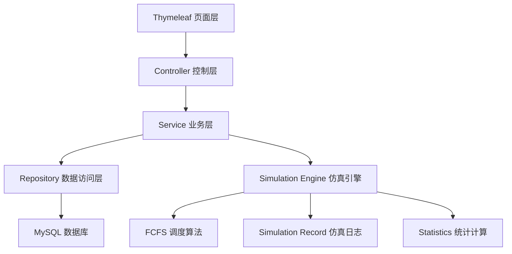
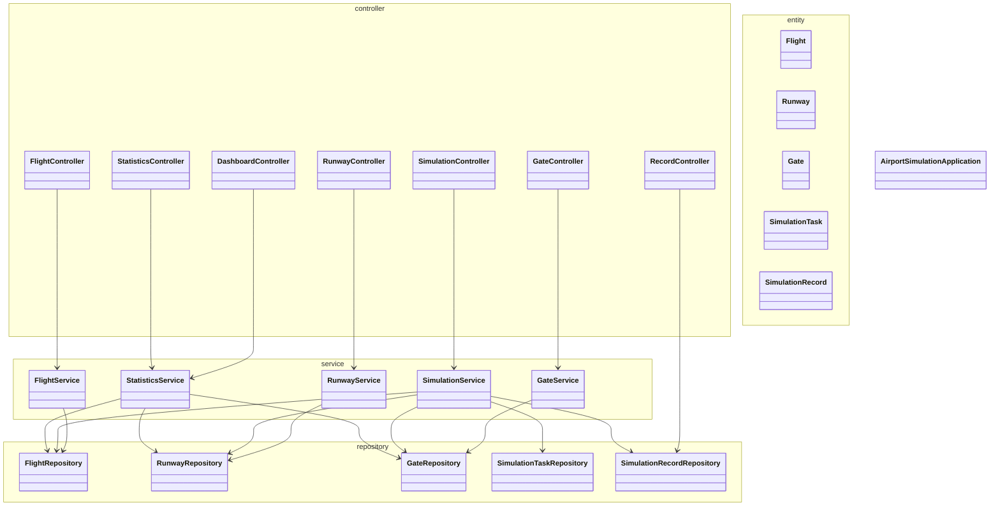
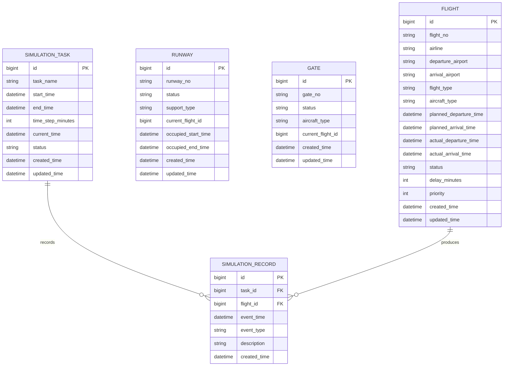
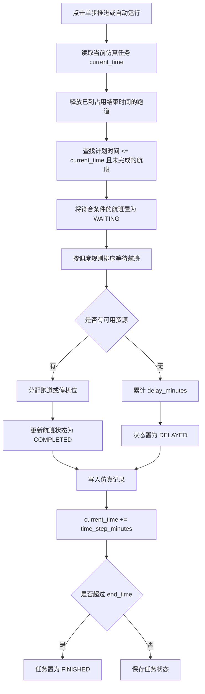

# 机场航班运行仿真系统 Task 1/2/3 开发记录

记录时间：2026-05-29  
项目路径：`D:\Desktop\airport-flight-simulation`  
项目名称：机场航班运行仿真系统  
英文名称：Airport Flight Simulation System  
技术路线：Java 17 + Spring Boot + Maven + MySQL + Thymeleaf + JUnit 5

## 1. 本次对话总体目标

本次对话的目标是从项目总体规划文件出发，协助完成机场航班运行仿真系统的前期设计和前三个开发任务。

用户提供了项目工作地址：

```text
D:\Desktop\airport-flight-simulation
```

用户说明总体规划文件位置：

```text
D:\Desktop\airport-flight-simulation\project.md
```

经过检查，项目目录最初只有规划文件，没有代码工程。随后确认项目按“标准版 Web 系统”实施，采用 Spring Boot + MySQL + Thymeleaf 的方式完成可运行、可演示、可测试的课程实验项目。

## 2. 已确认的项目范围

本项目最终按“标准版”完成，不做过度扩展。

标准版需要完成：

1. 航班管理。
2. 跑道管理。
3. 停机位管理。
4. 仿真任务创建。
5. 单步推进和自动运行仿真。
6. FCFS 调度算法。
7. 仿真日志记录。
8. 统计结果展示。
9. MySQL 数据持久化。
10. 基础测试用例。

暂不纳入第一版：

1. 用户登录。
2. 天气影响。
3. 复杂图表。
4. 多调度算法对比。
5. 紧急航班特殊优先策略。

这些功能后续可以作为报告中的“系统扩展方向”描述。

## 3. 已确认的实现方案

本次对话中对比了三种实现路线：

1. 方案 A：Spring Boot + MySQL + Thymeleaf 页面优先。
2. 方案 B：Spring Boot REST 接口优先。
3. 方案 C：先完整后端，再补页面。

最终确认采用方案 A。

选择理由：

1. 适合软件工程实验展示。
2. 老师可以直接通过浏览器查看系统功能。
3. 三层架构清晰，便于写需求分析、概要设计和测试报告。
4. 与用户已有环境 Java、Maven、MySQL 匹配。
5. 页面复杂度可控，不需要前后端分离。

## 4. 系统 UML 架构图

### 4.1 分层架构图



各层职责：

1. 页面层：负责显示表格、表单、按钮、统计结果和仿真日志。
2. Controller 层：负责接收页面请求并组织页面数据。
3. Service 层：负责业务规则、仿真推进、调度算法和统计计算。
4. Repository 层：负责数据库访问。
5. 数据库层：负责持久化航班、跑道、停机位、仿真任务和仿真记录。

### 4.2 包结构 UML 图



说明：Controller 和 Service 是后续 Task 4、Task 5、Task 6 的主要内容；Task 1/2/3 已经完成应用入口、实体、枚举、Repository 和 SQL 脚本。

## 5. 数据库 ER 图



## 6. 核心仿真流程设计

本次对话中确认采用离散时间步仿真，例如每次推进 5 分钟或 10 分钟。



调度规则：

1. 计划时间越早，越优先处理。
2. 同一计划时间下，降落航班优先于起飞航班。
3. 同一计划时间和类型下，`priority` 数值越大越优先。
4. 起飞航班需要可用跑道。
5. 降落航班需要可用跑道和适配机型的空闲停机位。
6. 没有资源时航班继续等待，并累计延误时间。
7. 跑道占用时间统一为一个时间步，下一步开始时释放。
8. 降落航班完成后，停机位保持占用，用于展示资源使用情况。

## 7. 已生成的设计与计划文档

本次对话已经生成并提交了两份前置文档。

### 7.1 设计说明文档

路径：

```text
D:\Desktop\airport-flight-simulation\docs\superpowers\specs\2026-05-29-airport-flight-simulation-design.md
```

主要内容：

1. 项目定位。
2. 标准版功能范围。
3. 系统三层架构。
4. 页面设计。
5. 数据库设计。
6. 枚举设计。
7. 核心仿真流程。
8. 调度规则。
9. 统计指标。
10. 测试范围。
11. 交付物说明。

对应 Git 提交：

```text
a1a6d32 Add airport simulation design spec
```

### 7.2 实施计划文档

路径：

```text
D:\Desktop\airport-flight-simulation\docs\superpowers\plans\2026-05-29-airport-flight-simulation-implementation.md
```

主要内容：

1. 项目整体文件结构。
2. Task 1：Maven 项目骨架。
3. Task 2：领域枚举和实体类。
4. Task 3：Repository 和数据库脚本。
5. Task 4：基础 CRUD Service。
6. Task 5：仿真和统计 Service。
7. Task 6：Controller 和 Thymeleaf 页面。
8. Task 7：README 和手工验证。

对应 Git 提交：

```text
6c11a2f Add airport simulation implementation plan
```

## 8. Task 1 开发记录：Spring Boot Maven 项目骨架

### 8.1 任务目标

Task 1 的目标是创建一个可以编译和运行测试的 Spring Boot Maven 工程骨架。

### 8.2 新增文件

```text
pom.xml
src/main/java/com/example/airportsimulation/AirportSimulationApplication.java
src/main/resources/application.yml
src/test/resources/application-test.yml
```

### 8.3 pom.xml 配置

项目使用 Spring Boot 3.3.5 和 Java 17。

核心依赖：

1. `spring-boot-starter-web`
2. `spring-boot-starter-thymeleaf`
3. `spring-boot-starter-data-jpa`
4. `mysql-connector-j`
5. `h2`
6. `spring-boot-starter-test`

### 8.4 应用入口

应用入口类：

```text
src/main/java/com/example/airportsimulation/AirportSimulationApplication.java
```

职责：

1. 标记 Spring Boot 应用。
2. 提供 `main` 方法。
3. 启动整个 Web 系统。

### 8.5 数据库配置

主配置文件：

```text
src/main/resources/application.yml
```

默认 MySQL 配置：

```yaml
spring:
  datasource:
    url: jdbc:mysql://localhost:3306/airport_simulation?useUnicode=true&characterEncoding=utf8&serverTimezone=Asia/Shanghai
    username: root
    password: root
  jpa:
    hibernate:
      ddl-auto: update
    show-sql: true
```

测试配置文件：

```text
src/test/resources/application-test.yml
```

测试使用 H2 内存数据库，避免单元测试依赖本机 MySQL。

### 8.6 验证结果

执行命令：

```powershell
mvn test
```

验证结果：

```text
BUILD SUCCESS
```

### 8.7 Git 提交

```text
a3b5861 chore: create spring boot project skeleton
```

## 9. Task 2 开发记录：领域枚举和 JPA 实体

### 9.1 任务目标

Task 2 的目标是根据设计文档创建系统核心领域模型，包括枚举类和 JPA 实体类。

### 9.2 测试先行

先创建测试：

```text
src/test/java/com/example/airportsimulation/entity/DomainModelDefaultsTest.java
```

测试目标：

1. `Flight` 默认状态为 `SCHEDULED`。
2. `Flight` 默认延误分钟数为 0。
3. `Flight` 默认优先级为 0。
4. `Runway` 默认状态为 `IDLE`。
5. `Runway` 默认支持类型为 `BOTH`。
6. `Gate` 默认状态为 `IDLE`。
7. `SimulationTask` 在创建时，如果 `currentTime` 为空，则设置为 `startTime`。

测试一开始因为实体类和枚举类不存在而失败，符合测试先行预期。

### 9.3 新增枚举类

```text
src/main/java/com/example/airportsimulation/enums/AircraftType.java
src/main/java/com/example/airportsimulation/enums/FlightStatus.java
src/main/java/com/example/airportsimulation/enums/FlightType.java
src/main/java/com/example/airportsimulation/enums/ResourceStatus.java
src/main/java/com/example/airportsimulation/enums/RunwaySupportType.java
src/main/java/com/example/airportsimulation/enums/SimulationEventType.java
src/main/java/com/example/airportsimulation/enums/SimulationTaskStatus.java
```

枚举说明：

1. `FlightType`：`DEPARTURE`、`ARRIVAL`。
2. `AircraftType`：`SMALL`、`MEDIUM`、`LARGE`。
3. `FlightStatus`：`SCHEDULED`、`WAITING`、`RUNNING`、`COMPLETED`、`DELAYED`、`CANCELLED`。
4. `ResourceStatus`：`IDLE`、`OCCUPIED`、`MAINTENANCE`。
5. `RunwaySupportType`：`TAKEOFF_ONLY`、`LANDING_ONLY`、`BOTH`。
6. `SimulationTaskStatus`：`CREATED`、`RUNNING`、`FINISHED`、`RESET`。
7. `SimulationEventType`：`ENTER_QUEUE`、`ASSIGN_RUNWAY`、`ASSIGN_GATE`、`TAKEOFF`、`LANDING`、`DELAY`、`COMPLETE`、`RELEASE_RESOURCE`。

### 9.4 新增实体类

```text
src/main/java/com/example/airportsimulation/entity/Flight.java
src/main/java/com/example/airportsimulation/entity/Runway.java
src/main/java/com/example/airportsimulation/entity/Gate.java
src/main/java/com/example/airportsimulation/entity/SimulationTask.java
src/main/java/com/example/airportsimulation/entity/SimulationRecord.java
```

实体职责：

1. `Flight`：保存航班计划、实际时间、状态、延误和优先级。
2. `Runway`：保存跑道编号、状态、支持类型和当前占用航班。
3. `Gate`：保存停机位编号、状态、适配机型和当前占用航班。
4. `SimulationTask`：保存仿真任务名称、开始时间、结束时间、步长、当前时间和状态。
5. `SimulationRecord`：保存仿真过程中的事件日志。

### 9.5 实体类通用设计

1. 使用 `@Entity` 和 `@Table` 映射数据库表。
2. 使用 `@Id` 和 `@GeneratedValue(strategy = GenerationType.IDENTITY)` 作为主键。
3. 枚举字段使用 `@Enumerated(EnumType.STRING)`。
4. 使用 `@PrePersist` 设置创建时间和更新时间。
5. 使用 `@PreUpdate` 更新时间。

### 9.6 验证结果

执行命令：

```powershell
mvn test
```

验证结果：

```text
Tests run: 4, Failures: 0, Errors: 0, Skipped: 0
BUILD SUCCESS
```

### 9.7 Git 提交

```text
e72ce2b feat: add airport simulation domain model
```

## 10. Task 3 开发记录：Repository 和数据库 SQL 脚本

### 10.1 任务目标

Task 3 的目标是创建 Spring Data JPA Repository 接口，并编写 MySQL 数据库初始化脚本。

### 10.2 测试先行

先创建测试：

```text
src/test/java/com/example/airportsimulation/repository/RepositoryQueryTest.java
```

测试目标：

1. 根据航班号关键字模糊查询航班。
2. 根据航班状态查询航班。
3. 查询最新创建的仿真任务。
4. 根据任务 ID 按事件时间和 ID 升序查询仿真记录。

测试一开始因为 Repository 接口不存在而编译失败，符合测试先行预期。

### 10.3 新增 Repository

```text
src/main/java/com/example/airportsimulation/repository/FlightRepository.java
src/main/java/com/example/airportsimulation/repository/RunwayRepository.java
src/main/java/com/example/airportsimulation/repository/GateRepository.java
src/main/java/com/example/airportsimulation/repository/SimulationTaskRepository.java
src/main/java/com/example/airportsimulation/repository/SimulationRecordRepository.java
```

Repository 方法：

1. `FlightRepository.findByFlightNoContainingIgnoreCase(String flightNo)`
2. `FlightRepository.findByStatus(FlightStatus status)`
3. `RunwayRepository.findByRunwayNo(String runwayNo)`
4. `RunwayRepository.findByStatus(ResourceStatus status)`
5. `GateRepository.findByGateNo(String gateNo)`
6. `GateRepository.findByStatus(ResourceStatus status)`
7. `SimulationTaskRepository.findTopByOrderByCreatedTimeDesc()`
8. `SimulationRecordRepository.findByTaskIdOrderByEventTimeAscIdAsc(Long taskId)`
9. `SimulationRecordRepository.findAllByOrderByEventTimeDescIdDesc()`

### 10.4 新增数据库脚本

数据库脚本路径：

```text
database/airport_simulation.sql
```

脚本内容包括：

1. 创建数据库 `airport_simulation`。
2. 删除旧表。
3. 创建 `flight` 表。
4. 创建 `runway` 表。
5. 创建 `gate` 表。
6. 创建 `simulation_task` 表。
7. 创建 `simulation_record` 表。
8. 插入示例跑道 `R01`、`R02`。
9. 插入示例停机位 `G01`、`G02`、`G03`。
10. 插入 8 条计划时间重叠的示例航班。

### 10.5 H2 测试配置修正

在 Repository 测试中遇到一个问题：

```text
current_time 在 H2 中被识别为关键字，导致 simulation_task 建表失败
```

解决方式：

1. 在 `application-test.yml` 的 H2 URL 中加入：

```text
NON_KEYWORDS=CURRENT_TIME
```

2. 在 `RepositoryQueryTest` 中加入：

```java
@AutoConfigureTestDatabase(replace = AutoConfigureTestDatabase.Replace.NONE)
```

这样测试会使用我们明确配置的 H2 MySQL 模式，而不是被 `@DataJpaTest` 自动替换成默认嵌入式数据库配置。

### 10.6 验证结果

执行命令：

```powershell
mvn test
```

验证结果：

```text
Tests run: 6, Failures: 0, Errors: 0, Skipped: 0
BUILD SUCCESS
```

### 10.7 Git 提交

```text
7cb273c feat: add repositories and database script
```

## 11. 当前 Git 提交记录

截至本报告生成时，主要提交如下：

```text
7cb273c feat: add repositories and database script
e72ce2b feat: add airport simulation domain model
a3b5861 chore: create spring boot project skeleton
6c11a2f Add airport simulation implementation plan
a1a6d32 Add airport simulation design spec
```

## 12. 当前测试状态

最新执行命令：

```powershell
mvn test
```

最新测试结果：

```text
Tests run: 6, Failures: 0, Errors: 0, Skipped: 0
BUILD SUCCESS
```

当前测试类：

```text
src/test/java/com/example/airportsimulation/entity/DomainModelDefaultsTest.java
src/test/java/com/example/airportsimulation/repository/RepositoryQueryTest.java
```

## 13. 当前项目文件结构概览

```text
D:\Desktop\airport-flight-simulation
├── pom.xml
├── database
│   └── airport_simulation.sql
├── docs
│   └── superpowers
│       ├── plans
│       │   └── 2026-05-29-airport-flight-simulation-implementation.md
│       └── specs
│           └── 2026-05-29-airport-flight-simulation-design.md
├── report
│   ├── task0.md
│   └── task1&2&3.md
├── src
│   ├── main
│   │   ├── java
│   │   │   └── com/example/airportsimulation
│   │   │       ├── AirportSimulationApplication.java
│   │   │       ├── entity
│   │   │       ├── enums
│   │   │       └── repository
│   │   └── resources
│   │       └── application.yml
│   └── test
│       ├── java
│       │   └── com/example/airportsimulation
│       │       ├── entity
│       │       └── repository
│       └── resources
│           └── application-test.yml
└── target
```

## 14. 后续任务

下一步是 Task 4：基础 CRUD Service。

Task 4 预计实现：

1. `FlightService`
2. `RunwayService`
3. `GateService`

主要功能：

1. 查询列表。
2. 根据 ID 查询。
3. 新增或更新。
4. 删除。
5. 基础参数校验。
6. 默认状态设置。

Task 4 完成后，项目将具备基础业务服务层，为后续 Controller 页面和仿真核心打基础。

## 15. 本次对话中的重要说明

1. 用户确认项目采用标准版。
2. 用户确认采用方案 A：Spring Boot + MySQL + Thymeleaf 页面优先。
3. 用户确认数据库采用 5 张核心表。
4. 用户确认仿真采用离散时间步和 FCFS 调度规则。
5. Task 1、Task 2、Task 3 均已完成并提交。
6. 当前测试全部通过。
7. 可视化伴随工具曾尝试启动，但 Windows 环境中本地服务连接失败，因此后续改用 Mermaid 图和 Markdown 文档表达架构。
